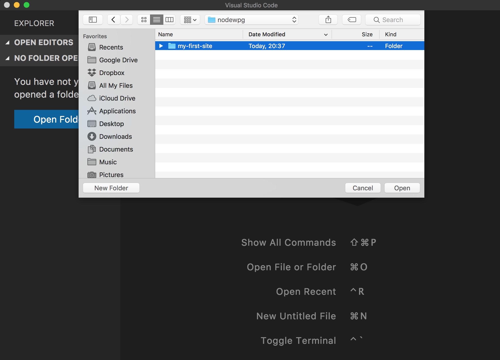
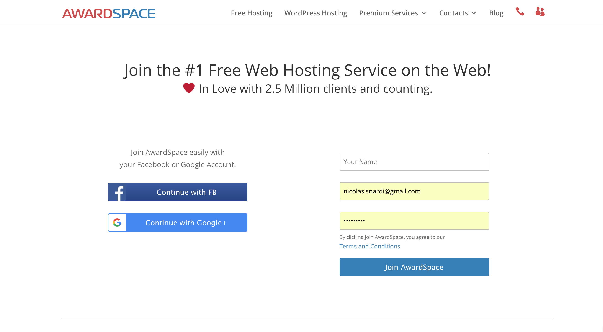
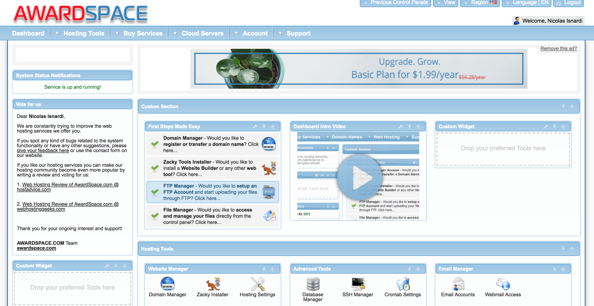
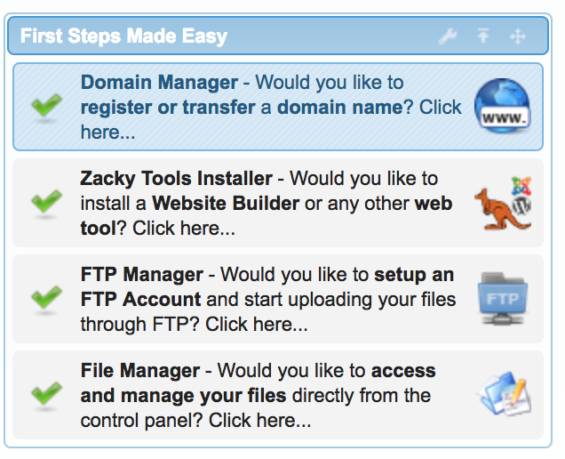
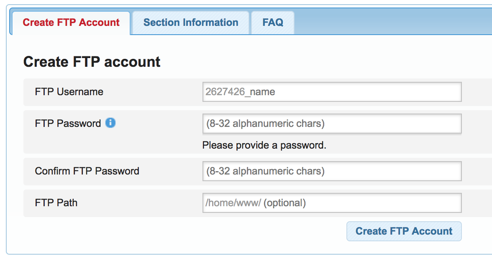
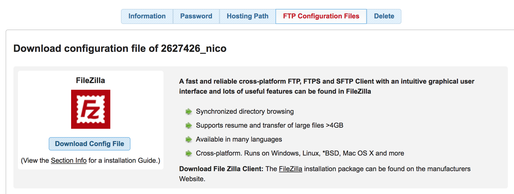
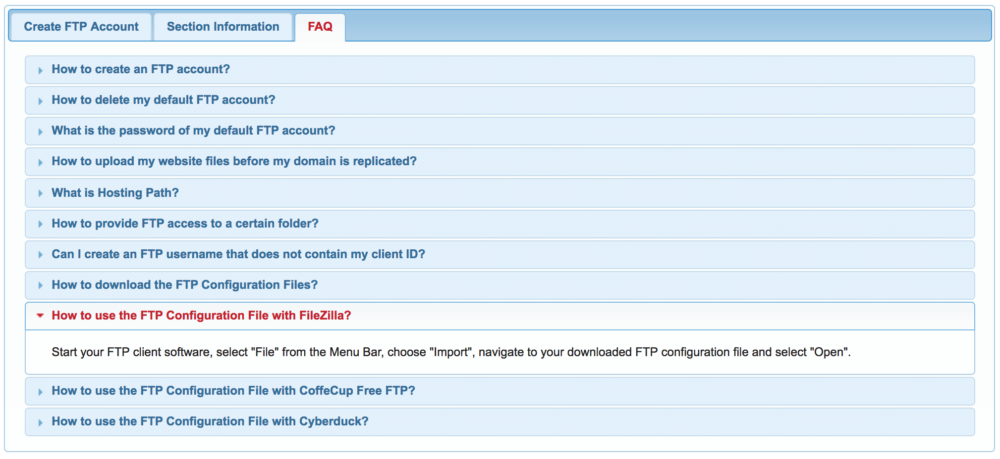

# Our First Site

Follow the next steps to create your first site!!

## Create a local site

1. Download & install [Visual Studio Code](https://code.visualstudio.com)
2. Create a folder with the name: my-first-site

3. Open Visual Studio Code

4. Open my-first-site using Visual Studio Code

5. Create the following files inside the my-first-site folder :
  * index.html
  * styles.css
  * script.js

6. Copy and Paste the following code on each document

### index.html
```html
<!DOCTYPE html>
<html lang="en">
<head>
  <title>My First Site</title>
  <link rel="stylesheet" href="styles.css">
  <link rel="shortcut icon" href="favicon.ico" type="image/x-icon">
</head>
<body>
  <div>
    <h1>Hello World!!!</h1>
    <p>Now let's conquer the world!!</p>
    <button>Click Me</button>
  </div>
  <script src="script.js" type="text/javascript"></script>
</body>
</html>
```

### style.css
```css
body {
  background-color: lightgray;
  font-family: Arial;
  text-align: center;
  display: flex;
  align-items: center;
  justify-content: center;
  height: 90vh;
  justify-content: center;
}

h1 {
  font-size: 72px;
}

p {
  font-size: 28px;
}

button {
    color: white;
    font-size: 125%;
    border-radius: 4px;
    border: none;
    text-shadow: 0 1px 1px rgba(0, 0, 0, 0.2);
    background: rgb(28, 184, 65);
    padding: 10px;
    outline: none;
    cursor: pointer;
}

button:hover {
  background: rgb(66, 184, 221);
  padding: 12px;
}
```

### script.js
```js
window.onload = function() {
  var button = document.querySelector('button');

  button.addEventListener('click', function() {
    alert("Let's Rock!!");
  });
}
```

7. Download the following [favicon.ico](resources/first-site/favicon.ico) to my-first-site folder
8. Go to the my-first-site folder and double click the file `index.html`
9. You should see a web page like this one:


## Publish our Site

At this point we created our first web but we can only access it from our computer as it's running locally.
To be able to publish it we need a free hosting and a domain.

1. Open a browser and navigate to [https://www.awardspace.com](https://www.awardspace.com)
2. Click on `Free hosting`
3. Click on `Give it a try`

4. Create your account using Facebook, Google or by input new credentials

5. You'll get a confirmation email with the system login information (it will be something like: [https://cp1.awardspace.net/beta](https://cp1.awardspace.net/beta))
6. Confirm your email account (if the email asks you to)
7. Login to the system using your credentials from the email

8. Configure a subdomain by clicking `Domain Manager` under the **First Steps Made Easy**

9. Select `Create a Free Subdomain`

10. Input a subdomain name and click the create button (this is the URL that we'll access online)
12. Now that we have a hosting and domain configured we need to upload our site to publish it.
13. Download & install [Filezilla](https://sourceforge.net/projects/filezilla/files/latest/download)
or any other [FTP](https://simple.wikipedia.org/wiki/FTP) client
14. Head to the AwardSpace Dashboard and click `FTP manager` section

15. Create an FTP account using username and password

16. Click on your ftp user name options button

17. Download FileZilla configuration file by clicking FTP configurations files button
* (If the FTP configuration download does not work, you will need to manually enter your FTP site, 
   username and password in FileZilla instead of opening the config in the next step)

18. Open & configure Filezilla using the configuration file

19. Click on the upper left icon to open the site manager

20. Change the **Login type:** to normal
21. Configure your **Password:** that you used while creating the ftp user
19. On the left side of the `Site Manager` you have your local files and on the right the hosting one

20. Find you my-first-site folder on the left side
21. Select all the files (press shift to select multiple files)
22. Drag the selected files to the right side
23. FileZilla will upload the selected files and place them on our hosting
24. Once it's done uploading refresh the subdomain that we created
25. **Congratulations, you have your first site online!!**


## Extra
* Change the h1 and p wording (index.html)
* Set the body background-color to red (style.css)
* Refresh the local site to see the changes
* Upload the changed files to deploy the new site version
* Try to create your own version of the site

## Resources
* [Favicon Generator](https://www.favicon-generator.org)
* [Awardspace FAQ](https://www.awardspace.com/frequently-asked-questions)
* [Getting started with Visual Studio Code - by John Papa](https://johnpapa.net/getting-started-with-visual-studio-code)

[<- Go Back](README.md)
